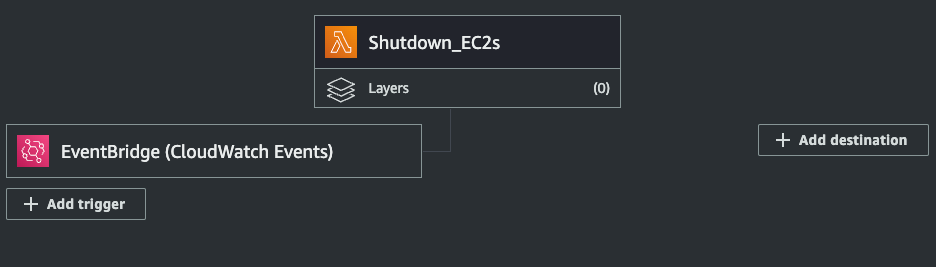
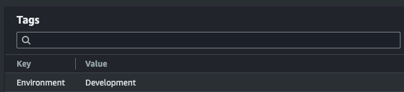

# Shutdown EC2 Instances Lambda Function

## Overview
This Python script will shut down all EC2 instances in a given region with a given tag. It is intended to be run as a Lambda function on a schedule.

## Lambda



### Configuration
Runtime = "Python 3.11"

Architecture = "x86_64"

Description: "Shutdown all EC2 instances in the ap-southeast-2 region with a tag "Environment=Development""

Handler = shutdown.lambda_handler

Environment Variables: 
* ACCESS_KEY
* SECRET_KEY
* REGION

Trigger = CloudWatch Events - shutdown_ec2_dev

## Python

### Dependencies

* boto3

## EC2
The following tag will need to be on the EC2 you wish to shut down:



## Build
To build the Lambda function, run the following command:

```shell
./package.sh
```

## TO DO
This was quickly created but will need to be revisited to:

1. Loop through AWS regions
2. Monitor on failure
3. Create Lambda using Terraform/boto3