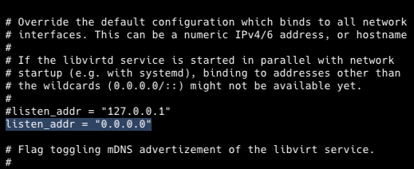

# Terraform for Unraid

## Requirements

1. mkisofs # This is required on the device you are running Terraform and is used to create the image and located in the PATH
2. Libvirt needs to be listening on 0.0.0.0 on the Unraid server

## Tested Using

Unraid version 6.11.3
Libvirt Terraform provider version 0.7.1

## Libvirt Provider
https://registry.terraform.io/providers/dmacvicar/libvirt/latest/docs

## mkisofs
https://sourceforge.net/projects/cdrtools/

## Change Libvirt Listen Address
1. Use your favorite command line editor to open `/etc/libvirt/libvirtd.conf`
2. Search for `listen_addr = "127.0.0.1"`
3. Change to `listen_addr = "0.0.0.0"`


## Expanding Cloud Init Disk
To expand the server disk you need to run `qemu-img` on the Unraid host.

_Example:_
```shell
vm_name="nameofserver"
vm_disk_size="desired size in GB"
version_ubuntu="Ubuntu version")
qemu-img resize /mnt/user/images/$vm_name-pool/$vm_name-ubuntu-$version_ubuntu.qcow2 +$vm_disk_size
virsh start $vm_name
```

## Helpful Examples

Example init: https://cloudinit.readthedocs.io/en/latest/topics/examples.html

Example tf: https://github.com/dmacvicar/terraform-provider-libvirt/blob/main/examples/v0.12/ubuntu/ubuntu-example.tf

Add user https://github.com/vmware/photon/issues/659 (How to set password)

Libvirt Listen Address: https://wiki.libvirt.org/page/Libvirt_daemon_is_not_listening_on_tcp_ports_although_configured_to
